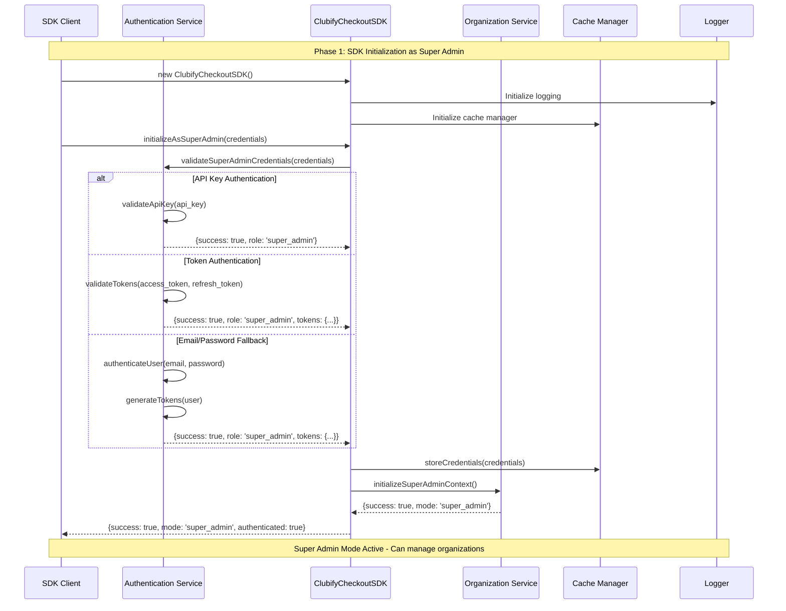
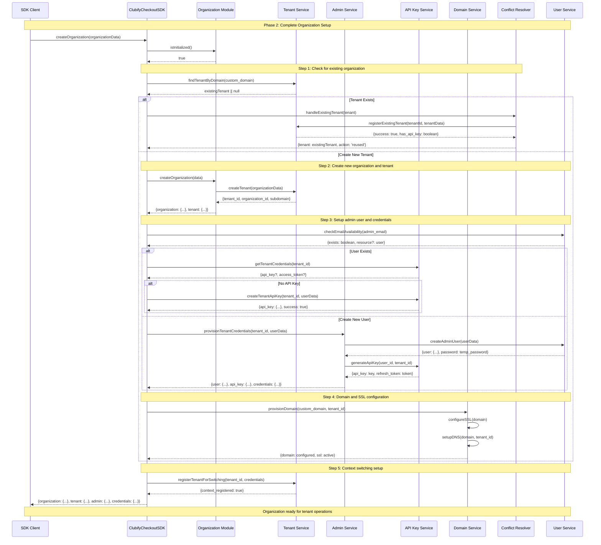
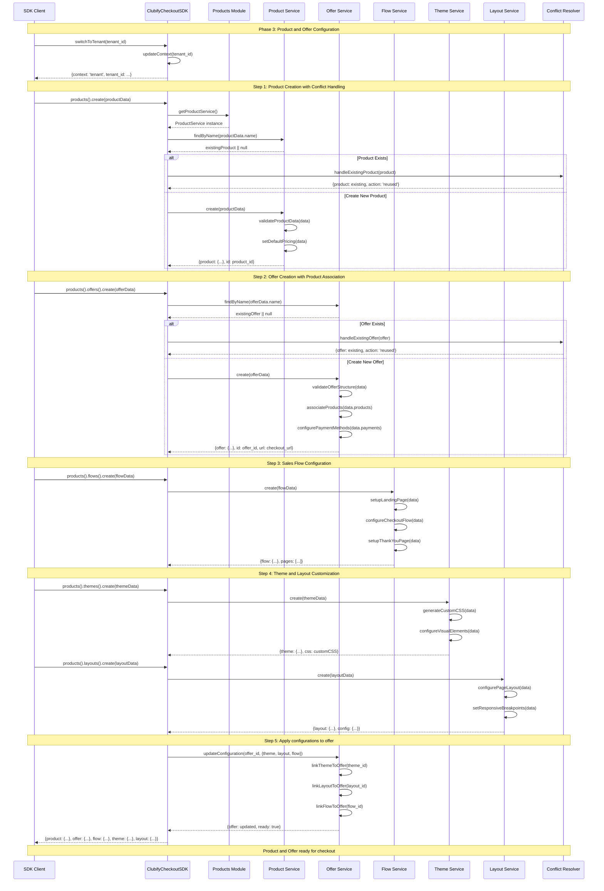
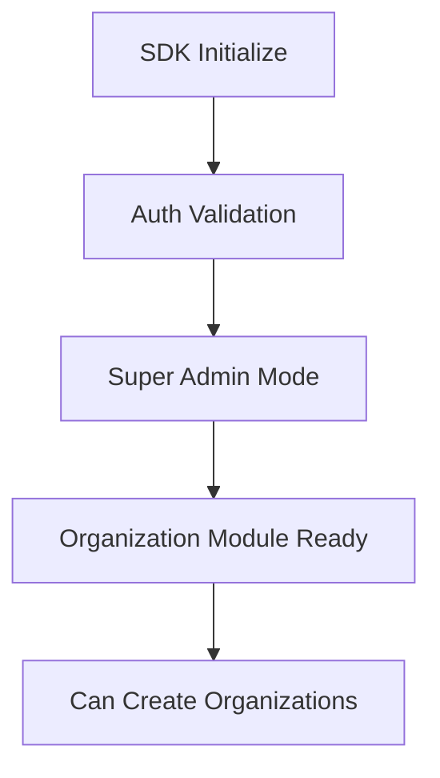
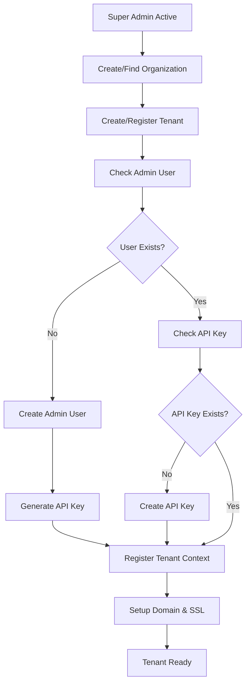
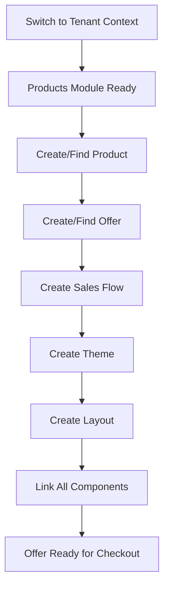
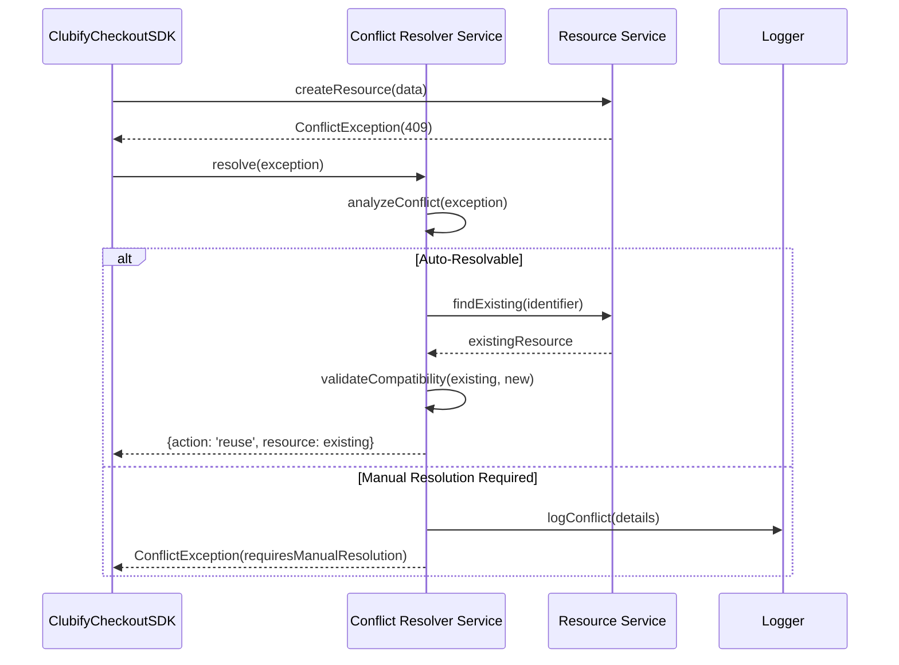

# Clubify Checkout - Sequence Diagrams and Flow Documentation

## Overview

This document provides comprehensive sequence diagrams and flow documentation for the Clubify checkout system, focusing on the complete setup process from organization creation to ready-to-use checkout flows.

## 1. Super-Admin Initialization Sequence

### Key Components
- **SDK Client**: PHP SDK instance
- **Authentication Service**: Token validation and role management
- **Organization Service**: Multi-tenant organization management
- **Tenant Service**: Individual tenant configuration
- **Credential Service**: API key and access token management

### Sequence Diagram: Super-Admin Initialization



## 2. Complete Tenant Creation and Configuration Flow

### Key Services
- **Organization Module**: Handles organization CRUD operations
- **Tenant Service**: Individual tenant management
- **Admin Service**: Admin user creation and management
- **API Key Service**: Credential generation and management
- **Domain Service**: Custom domain and SSL configuration

### Sequence Diagram: Complete Tenant Setup



## 3. Product and Offer Creation Workflow

### Key Services
- **Products Module**: Product CRUD and management
- **Product Service**: Individual product operations
- **Offer Service**: Offer creation and configuration
- **Flow Service**: Sales flow configuration
- **Theme Service**: Visual customization
- **Layout Service**: Page layout management

### Sequence Diagram: Product and Offer Setup



## 4. API Method Dependencies and Timing

### Critical Path Dependencies

#### Initialization Dependencies


#### Organization Setup Dependencies


#### Product/Offer Dependencies


### Timing Requirements

#### Synchronous Operations (Must Wait)
1. **Authentication**: All subsequent operations depend on valid credentials
2. **Context Switching**: Must complete before tenant-specific operations
3. **Product Creation**: Must exist before offer creation
4. **Offer Configuration**: Must be complete before checkout URL is functional

#### Asynchronous Operations (Can be Parallel)
1. **Domain SSL Setup**: Can happen in background after domain creation
2. **Theme CSS Generation**: Can be processed while other components are created
3. **Webhook Configuration**: Can be setup independently of main flow

### Method Call Sequence for Complete Setup

#### 1. Super Admin Initialization
```php
$sdk = new ClubifyCheckoutSDK();
$result = $sdk->initializeAsSuperAdmin($credentials);
// Dependencies: None
// Timing: Must complete first (3-5 seconds)
```

#### 2. Organization Creation
```php
$organization = $sdk->createOrganization($organizationData);
// Dependencies: Super admin mode active
// Timing: 5-15 seconds (includes user creation, API key generation)
```

#### 3. Context Switch
```php
$sdk->switchToTenant($tenantId);
// Dependencies: Tenant registered with API key
// Timing: Immediate (< 1 second)
```

#### 4. Product Creation
```php
$product = $sdk->products()->create($productData);
// Dependencies: Valid tenant context
// Timing: 2-5 seconds
```

#### 5. Offer Creation
```php
$offer = $sdk->products()->offers()->create($offerData);
// Dependencies: Product exists
// Timing: 3-8 seconds (includes configuration)
```

#### 6. Flow, Theme, Layout Setup (Can be parallel)
```php
// These can run simultaneously
$flow = $sdk->products()->flows()->create($flowData);    // 2-4 seconds
$theme = $sdk->products()->themes()->create($themeData); // 1-3 seconds
$layout = $sdk->products()->layouts()->create($layoutData); // 1-2 seconds
```

#### 7. Final Configuration
```php
$finalOffer = $sdk->products()->offers()->updateConfiguration($offerId, $config);
// Dependencies: All components created
// Timing: 1-3 seconds
```

## 5. Error Handling and Conflict Resolution

### Common Conflict Scenarios

#### Organization Conflicts
- **Subdomain already exists**: Reuse existing tenant or generate alternative
- **Email already registered**: Use existing user or create with different email
- **Domain already configured**: Reuse existing configuration

#### Product/Offer Conflicts
- **Product name collision**: Append suffix or reuse existing
- **Offer URL collision**: Generate unique URL or reuse existing
- **Theme name collision**: Create variant or reuse existing

### Conflict Resolution Sequence



## Summary

The Clubify checkout system follows a structured initialization and configuration flow:

1. **Super Admin Initialization** (3-5s): Authenticate and establish super admin context
2. **Organization Setup** (10-20s): Create/find organization, setup tenant, provision credentials
3. **Context Switching** (<1s): Switch to tenant context for operations
4. **Product Creation** (2-5s): Create or reuse products with validation
5. **Offer Configuration** (5-15s): Create offers with products, flows, themes, and layouts
6. **Final Integration** (1-3s): Link all components and generate checkout URLs

The system is designed with **resilience** and **idempotency** in mind, allowing repeated executions without creating duplicate resources. Conflict resolution handles common scenarios automatically, while providing detailed logging for manual intervention when required.

Total setup time for a complete organization with checkout ready: **20-45 seconds** depending on complexity and conflicts.