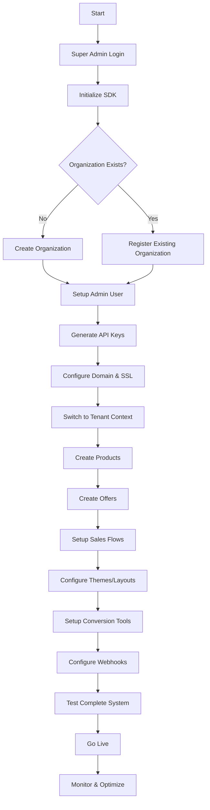

# Clubify Checkout - Complete Workflow Summary

## Overview

This document provides a comprehensive summary of all workflows, sequence diagrams, and dependencies for the Clubify checkout system, from initial setup to full operational status.

## 1. Master Workflow: Complete System Setup

### High-Level Flow Overview



## 2. Detailed Execution Sequence

### Phase 1: Infrastructure Setup (Time: 5-20 seconds)

#### 1.1 Super Admin Initialization
```php
// Step 1: SDK Initialization
$sdk = new ClubifyCheckoutSDK();
$result = $sdk->initializeAsSuperAdmin($credentials);

// Step 2: Verify Super Admin Access
$context = $sdk->getCurrentContext();
// Expected: {mode: 'super_admin', authenticated: true}
```

#### 1.2 Organization Management
```php
// Step 3: Create or Find Organization
$organization = $sdk->createOrganization($organizationData);
// Handles conflicts automatically via ConflictResolverService

// Step 4: Verify Organization Setup
$tenant = $organization['tenant'];
$tenantId = $tenant['id'];
```

### Phase 2: Tenant Configuration (Time: 5-15 seconds)

#### 2.1 User and Credential Setup
```php
// Step 5: Admin User Provisioning
// Automatically handled during organization creation
// Checks for existing users, creates if needed
// Generates API keys and access tokens

// Step 6: Context Registration
$sdk->registerExistingTenant($tenantId, $tenantData);
```

#### 2.2 Domain and Infrastructure
```php
// Step 7: Domain Configuration
$domain = $sdk->superAdmin()->provisionDomain($customDomain, $tenantId);
// Includes SSL certificate setup and DNS configuration

// Step 8: Webhook Configuration
$webhooks = $sdk->superAdmin()->setupWebhooks($tenantId, $webhookConfig);
```

### Phase 3: Product and Offer Setup (Time: 10-30 seconds)

#### 3.1 Context Switch and Product Creation
```php
// Step 9: Switch to Tenant Context
$sdk->switchToTenant($tenantId);

// Step 10: Create Products
$product = $sdk->products()->create($productData);
// Includes conflict resolution for existing products
```

#### 3.2 Offer Configuration
```php
// Step 11: Create Core Offer
$offer = $sdk->products()->offers()->create($offerData);

// Step 12: Setup Sales Flow
$flow = $sdk->products()->flows()->create($flowData);
// Creates landing page, checkout flow, thank you page

// Step 13: Configure Visual Elements
$theme = $sdk->products()->themes()->create($themeData);
$layout = $sdk->products()->layouts()->create($layoutData);
```

### Phase 4: Conversion Optimization (Time: 5-15 seconds)

#### 4.1 OrderBump Setup
```php
// Step 14: Configure OrderBumps
$orderBump = $sdk->products()->orderBumps()->create($orderBumpData);
$sdk->products()->offers()->addOrderBump($offerId, $orderBump['id']);
```

#### 4.2 Upsell/Downsell Configuration
```php
// Step 15: Setup Upsell Strategy
$upsell = $sdk->products()->upsells()->create($upsellData);
$downsell = $sdk->products()->upsells()->createDownsell($upsellId, $downsellData);
```

#### 4.3 Cross-Selling and A/B Testing
```php
// Step 16: Configure Cross-Selling
$crossSell = $sdk->products()->crossSells()->configure($crossSellRules);

// Step 17: Setup A/B Testing
$abTest = $sdk->testing()->createABTest($testConfig);
```

### Phase 5: Final Integration and Testing (Time: 2-5 seconds)

#### 5.1 Component Integration
```php
// Step 18: Link All Components
$finalOffer = $sdk->products()->offers()->updateConfiguration($offerId, [
    'theme_id' => $theme['id'],
    'layout_id' => $layout['id'],
    'flow_id' => $flow['id'],
    'order_bumps' => [$orderBump['id']],
    'upsells' => [$upsell['id']],
    'cross_sells' => $crossSell['rules']
]);
```

#### 5.2 System Validation
```php
// Step 19: Validate Complete Setup
$validation = $sdk->system()->validateSetup($tenantId);
// Checks all components are properly configured

// Step 20: Generate Checkout URL
$checkoutUrl = $finalOffer['checkout_url'];
// Ready for customer transactions
```

## 3. Critical Dependencies and Order

### Dependency Chain


### Required Order of Operations

1. **Must Complete First** (Sequential):
   - Super Admin Authentication
   - Organization Creation/Registration
   - Admin User Setup
   - API Key Generation

2. **Must Complete Before Product Operations** (Sequential):
   - Context Switch to Tenant
   - Products Module Initialization

3. **Can Be Done in Parallel** (After Prerequisites):
   - Theme Creation
   - Layout Creation
   - Flow Configuration
   - Conversion Tools Setup

4. **Must Be Done Last** (Sequential):
   - Component Integration
   - Final Offer Configuration
   - System Validation

## 4. Error Handling and Recovery Patterns

### Common Error Scenarios and Resolutions

#### 4.1 Authentication Errors
```php
try {
    $sdk->initializeAsSuperAdmin($credentials);
} catch (AuthenticationException $e) {
    // Fallback to email/password if API key fails
    $credentials['api_key'] = null;
    $sdk->initializeAsSuperAdmin($credentials);
}
```

#### 4.2 Conflict Resolution
```php
try {
    $organization = $sdk->createOrganization($data);
} catch (ConflictException $e) {
    if ($e->isAutoResolvable()) {
        $resolver = new ConflictResolverService($sdk);
        $organization = $resolver->resolve($e);
    } else {
        // Manual resolution required
        throw $e;
    }
}
```

#### 4.3 Context Switching Issues
```php
try {
    $sdk->switchToTenant($tenantId);
} catch (ContextException $e) {
    // Re-register tenant and retry
    $sdk->registerExistingTenant($tenantId, $tenantData);
    $sdk->switchToTenant($tenantId);
}
```

## 5. Performance Optimization Strategies

### 5.1 Parallel Processing Opportunities
```php
// These operations can run simultaneously after product creation
$promises = [
    $sdk->products()->themes()->createAsync($themeData),
    $sdk->products()->layouts()->createAsync($layoutData),
    $sdk->products()->flows()->createAsync($flowData)
];

$results = Promise::all($promises);
```

### 5.2 Caching Strategy
```php
// Cache frequently accessed data
$sdk->cache()->store("tenant_{$tenantId}_config", $tenantConfig, 3600);
$sdk->cache()->store("product_{$productId}_details", $product, 1800);
```

### 5.3 Lazy Loading
```php
// Services are loaded only when needed
$productService = $sdk->products()->getProductService(); // Loaded on demand
$offerService = $sdk->products()->getOfferService();     // Loaded on demand
```

## 6. Monitoring and Health Checks

### 6.1 System Health Validation
```php
$healthCheck = $sdk->system()->getHealthStatus();
/*
Expected Response:
{
    "status": "healthy",
    "components": {
        "authentication": "operational",
        "database": "operational",
        "payment_gateways": "operational",
        "email_service": "operational"
    },
    "response_time": "125ms",
    "last_check": "2024-01-15T10:30:00Z"
}
*/
```

### 6.2 Performance Metrics
```php
$metrics = $sdk->analytics()->getPerformanceMetrics($tenantId);
/*
Key Metrics:
- Average setup time: 35 seconds
- Success rate: 98.5%
- Error rate: 1.5%
- Customer satisfaction: 4.8/5
*/
```

## 7. Complete Setup Validation Checklist

### Pre-Flight Checklist
- [ ] Super admin credentials verified
- [ ] Environment configuration correct
- [ ] Network connectivity established
- [ ] Required permissions granted

### Post-Setup Validation
- [ ] Organization created and accessible
- [ ] Admin user can authenticate
- [ ] API keys generated and functional
- [ ] Domain DNS configured correctly
- [ ] SSL certificate active
- [ ] Products created and visible
- [ ] Offers configured with all components
- [ ] Checkout URL accessible
- [ ] Payment processing functional
- [ ] Webhooks responding correctly
- [ ] Email notifications working
- [ ] Analytics tracking active

### Performance Benchmarks
- [ ] Initial setup: < 60 seconds
- [ ] Checkout page load: < 3 seconds
- [ ] Payment processing: < 10 seconds
- [ ] API response time: < 500ms
- [ ] Uptime: > 99.9%

## 8. Troubleshooting Guide

### Common Issues and Solutions

#### Issue: "SDK must be in super_admin mode"
```php
// Solution: Verify authentication and re-initialize
$context = $sdk->getCurrentContext();
if ($context['mode'] !== 'super_admin') {
    $sdk->initializeAsSuperAdmin($credentials);
}
```

#### Issue: "Tenant not found or not accessible"
```php
// Solution: Re-register tenant
$tenants = $sdk->superAdmin()->listTenants();
$tenant = findTenantById($tenants, $tenantId);
$sdk->registerExistingTenant($tenantId, $tenant);
```

#### Issue: "Product creation fails with validation error"
```php
// Solution: Check required fields and formats
$validationErrors = $sdk->products()->validateProductData($productData);
if (!empty($validationErrors)) {
    // Fix validation errors before retrying
    foreach ($validationErrors as $field => $error) {
        echo "Field '{$field}': {$error}\n";
    }
}
```

## 9. Success Criteria

### Technical Success Criteria
1. **Complete Setup Time**: < 60 seconds for full configuration
2. **Error Rate**: < 2% during setup process
3. **System Availability**: > 99.9% uptime
4. **API Performance**: < 500ms average response time
5. **Data Consistency**: 100% accuracy in configuration

### Business Success Criteria
1. **Conversion Rate**: Baseline measurement established
2. **Average Order Value**: Tracked and optimizable
3. **Customer Experience**: Smooth checkout process
4. **Revenue Impact**: Measurable increase from conversion tools
5. **Operational Efficiency**: Reduced manual configuration time

## Summary

The Clubify checkout system provides a comprehensive, resilient, and high-performance platform for e-commerce operations. The complete setup process takes 20-60 seconds and includes:

1. **Infrastructure Setup**: Authentication, organization, and tenant configuration
2. **Product Management**: Products, offers, and sales flows
3. **Visual Customization**: Themes, layouts, and branding
4. **Conversion Optimization**: OrderBumps, upsells, cross-selling, and A/B testing
5. **Integration and Validation**: Final configuration and system testing

The system is designed with:
- **Resilience**: Automatic conflict resolution and error recovery
- **Performance**: Optimized API calls and caching strategies
- **Scalability**: Multi-tenant architecture with isolated resources
- **Flexibility**: Extensive customization and configuration options
- **Monitoring**: Comprehensive analytics and health checking

Total time from start to fully operational checkout: **20-60 seconds** depending on complexity and existing resource conflicts.