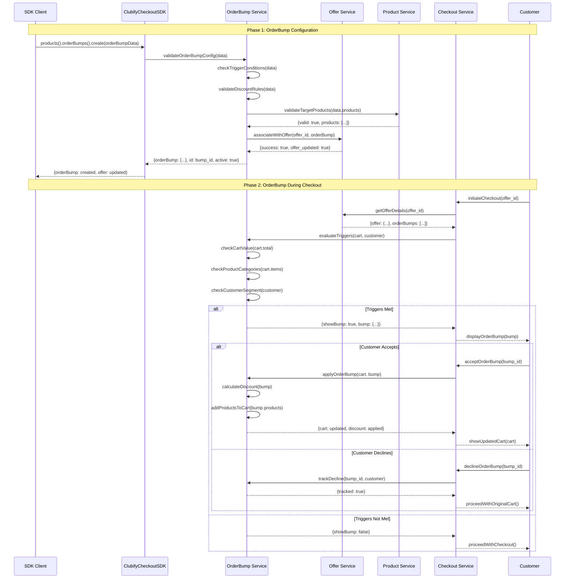
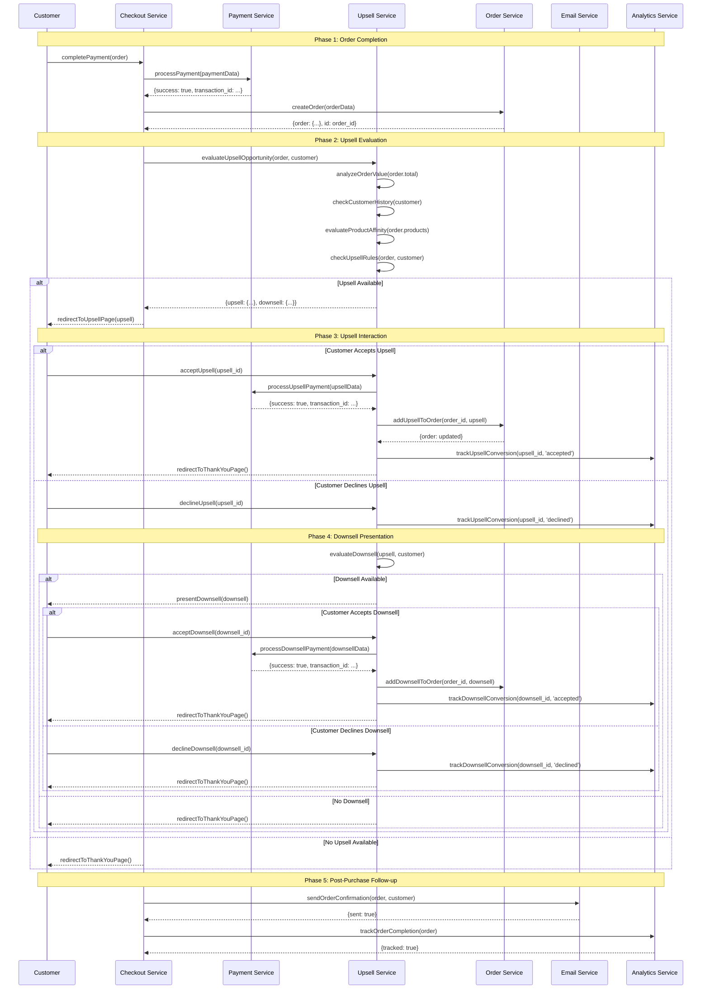
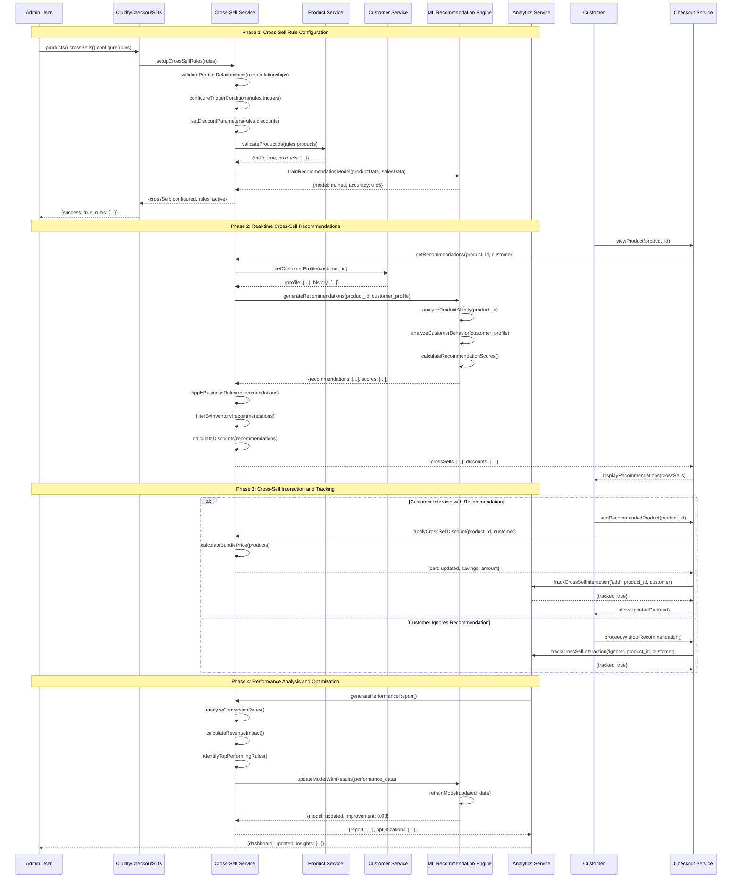
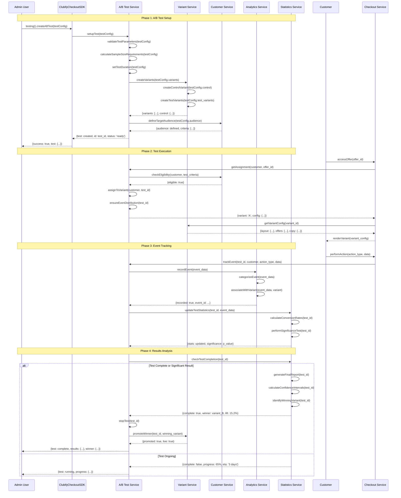

# Clubify Checkout - Conversion Tools Workflows

## Overview

This document provides detailed sequence diagrams and workflows for the conversion optimization tools in the Clubify checkout system, including OrderBumps, Upsells, Downsells, and cross-selling strategies.

## 1. OrderBump Configuration Workflow

OrderBumps are additional offers presented during the checkout process to increase average order value.

### Sequence Diagram: OrderBump Setup and Processing

## 2. Upsell and Downsell Strategy Workflow

Upsells are post-purchase offers to increase customer lifetime value, while downsells provide alternative options if the upsell is declined.

### Sequence Diagram: Upsell/Downsell Flow

## 3. Cross-Selling Strategy Configuration

Cross-selling involves recommending complementary products based on customer behavior and product relationships.

### Sequence Diagram: Cross-Sell Setup and Execution

## 4. A/B Testing for Conversion Optimization

A/B testing allows for data-driven optimization of conversion strategies.

### Sequence Diagram: A/B Test Configuration and Execution

## 5. Performance Metrics and KPIs

### Key Metrics Tracked

#### OrderBump Metrics
- **OrderBump Acceptance Rate**: Percentage of customers who accept the order bump
- **Average Order Value Increase**: Revenue increase from order bumps
- **OrderBump Revenue**: Total additional revenue generated
- **Trigger Efficiency**: How well trigger conditions identify opportunities

#### Upsell/Downsell Metrics
- **Upsell Conversion Rate**: Percentage of completed orders that convert to upsells
- **Downsell Conversion Rate**: Percentage of declined upsells that convert to downsells
- **Customer Lifetime Value Impact**: Long-term revenue increase from upsell customers
- **Average Upsell Value**: Average revenue per upsell transaction

#### Cross-Sell Metrics
- **Cross-Sell Click-Through Rate**: Percentage of recommendations clicked
- **Cross-Sell Conversion Rate**: Percentage of clicks that result in purchases
- **Bundle Penetration**: Percentage of orders with cross-sell products
- **Recommendation Accuracy**: ML model performance metrics

#### A/B Testing Metrics
- **Statistical Significance**: Confidence level of test results
- **Conversion Lift**: Percentage improvement of winning variant
- **Sample Size**: Number of participants in each variant
- **Test Velocity**: Time to reach statistical significance

### Implementation Timeline

| Phase | Duration | Key Activities |
|-------|----------|----------------|
| **Setup** | 1-2 days | Configure services, create rules, setup tracking |
| **Testing** | 1-4 weeks | Run A/B tests, gather data, optimize parameters |
| **Optimization** | Ongoing | Continuous improvement based on performance data |
| **Scaling** | 2-3 weeks | Expand successful strategies to more offers |

## Summary

The conversion tools in Clubify checkout system provide comprehensive capabilities for revenue optimization:

1. **OrderBumps**: Real-time cart value increase during checkout
2. **Upsells/Downsells**: Post-purchase revenue expansion with fallback options
3. **Cross-Selling**: AI-powered product recommendations
4. **A/B Testing**: Data-driven optimization of all conversion strategies

Each tool includes sophisticated targeting, real-time decision making, comprehensive tracking, and continuous optimization capabilities. The system supports both rule-based and machine learning-driven approaches for maximum flexibility and effectiveness.