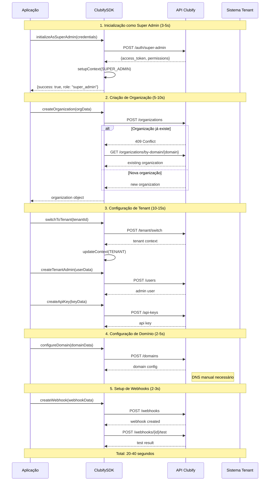

# Clubify Checkout SDK para PHP

[](https://packagist.org/packages/clubify/checkout-sdk-php)
[](https://github.com/clubifyhq/checkout-sdk-php/blob/main/LICENSE)
[](https://php.net)
[](https://laravel.com)

SDK oficial para integração com a plataforma Clubify Checkout. Uma solução completa para gerenciar organizações, produtos, ofertas e processos de checkout em aplicações PHP e Laravel.

## 📋 Índice

- [Instalação e Configuração](#-instalação-e-configuração)
- [Arquitetura e Estrutura](#-arquitetura-e-estrutura)
- [Configuração Inicial](#-configuração-inicial)
- [Sequência de Configuração Completa](#-sequência-de-configuração-completa)
- [Exemplos de Uso](#-exemplos-de-uso)
- [Troubleshooting](#-troubleshooting)
- [Referência da API](#-referência-da-api)

---

## 🚀 Instalação e Configuração

### Requisitos do Sistema

- **PHP**: 8.2+ (recomendado 8.3+)
- **Extensões**: `curl`, `json`, `mbstring`, `openssl`
- **Composer**: 2.0+
- **Memória**: Mínimo 128MB (recomendado 256MB+)

### Instalação via Composer

```bash
# Instalação padrão
composer require clubify/checkout-sdk-php

# Para desenvolvimento/testes
composer require clubify/checkout-sdk-php --dev
```

### Configuração para Laravel

#### 1. Instalação Automática (Recomendado)

```bash
# Executa configuração completa
php artisan clubify:install

# Opções disponíveis:
php artisan clubify:install --force              # Sobrescreve arquivos existentes
php artisan clubify:install --config-only        # Publica apenas configuração
php artisan clubify:install --no-publish         # Pula publicação de assets
```

#### 2. Configuração Manual

```bash
# Publica arquivo de configuração
php artisan vendor:publish --provider="Clubify\Checkout\Laravel\ClubifyCheckoutServiceProvider" --tag=clubify-checkout-config

# Publica todos os assets
php artisan vendor:publish --provider="Clubify\Checkout\Laravel\ClubifyCheckoutServiceProvider"
```

#### 3. Variáveis de Ambiente

Adicione ao seu arquivo `.env`:

```env
# OBRIGATÓRIO - Autenticação Básica
CLUBIFY_CHECKOUT_API_KEY=your-api-key-here
CLUBIFY_CHECKOUT_API_SECRET=your-api-secret-here
CLUBIFY_CHECKOUT_TENANT_ID=your-tenant-id-here

# OBRIGATÓRIO - Configurações de Ambiente
CLUBIFY_CHECKOUT_ENVIRONMENT=sandbox
CLUBIFY_CHECKOUT_BASE_URL=https://checkout.svelve.com/api/v1

# OPCIONAL - Performance e Comportamento
CLUBIFY_CHECKOUT_TIMEOUT=30
CLUBIFY_CHECKOUT_CONNECT_TIMEOUT=10
CLUBIFY_CHECKOUT_RETRY_ATTEMPTS=3
CLUBIFY_CHECKOUT_RETRY_DELAY=1000
CLUBIFY_CHECKOUT_DEBUG=false

# OPCIONAL - Cache
CLUBIFY_CHECKOUT_CACHE_ENABLED=true
CLUBIFY_CHECKOUT_CACHE_TTL=3600
CLUBIFY_CHECKOUT_CACHE_PREFIX=clubify_checkout
CLUBIFY_CHECKOUT_CACHE_STORE=default

# OPCIONAL - Logging
CLUBIFY_CHECKOUT_LOGGER_ENABLED=true
CLUBIFY_CHECKOUT_LOGGER_LEVEL=info
CLUBIFY_CHECKOUT_LOGGER_CHANNEL=single

# OPCIONAL - Webhooks
CLUBIFY_CHECKOUT_WEBHOOKS_ENABLED=true
CLUBIFY_CHECKOUT_WEBHOOK_SECRET=your-webhook-secret
CLUBIFY_CHECKOUT_WEBHOOK_TOLERANCE=300

# OPCIONAL - Webhooks Multi-Tenant (requer config adicional no arquivo de config)
CLUBIFY_ORGANIZATION_MODEL=\\App\\Models\\Organization
CLUBIFY_WEBHOOK_SECRET_KEY=clubify_checkout_webhook_secret
```

### Configuração para PHP Vanilla

```php
<?php

require_once 'vendor/autoload.php';

use Clubify\Checkout\ClubifyCheckoutSDK;

$sdk = new ClubifyCheckoutSDK([
    'api_key' => 'clb_live_your_api_key',
    'api_secret' => 'your_api_secret',
    'tenant_id' => 'your_tenant_id',
    'environment' => 'sandbox', // 'development', 'sandbox', 'staging', 'production'
    'base_url' => 'https://checkout.svelve.com/api/v1',

    'http' => [
        'timeout' => 30,
        'connect_timeout' => 10,
        'retry' => [
            'enabled' => true,
            'attempts' => 3,
            'delay' => 1000,
        ],
    ],

    'cache' => [
        'enabled' => true,
        'default_ttl' => 3600,
    ],

    'logger' => [
        'enabled' => true,
        'level' => 'info',
    ],
]);

// Inicializar SDK
$result = $sdk->initialize();

if ($result['success']) {
    echo "✅ SDK inicializado com sucesso!";
} else {
    echo "❌ Falha na inicialização: " . $result['message'];
}
```

---

## 🏗️ Arquitetura e Estrutura

### Estrutura de Diretórios

```
/sdk/php/
├── src/                          # Código fonte
│   ├── ClubifyCheckoutSDK.php    # Ponto de entrada principal
│   ├── Core/                     # Infraestrutura central
│   │   ├── Auth/                 # Gerenciamento de autenticação
│   │   ├── Cache/                # Sistema de cache
│   │   ├── Config/               # Gerenciamento de configuração
│   │   ├── Events/               # Sistema de eventos
│   │   ├── Http/                 # Cliente HTTP
│   │   └── Logger/               # Sistema de logging
│   ├── Laravel/                  # Integração Laravel
│   │   ├── ClubifyCheckoutServiceProvider.php
│   │   ├── Facades/              # Laravel facades
│   │   ├── Commands/             # Comandos Artisan
│   │   ├── Jobs/                 # Jobs de fila
│   │   ├── Middleware/           # Middleware HTTP
│   │   └── Rules/                # Regras de validação
│   ├── Modules/                  # Módulos de negócio
│   │   ├── Cart/                 # Gerenciamento de carrinho
│   │   ├── Checkout/             # Processo de checkout
│   │   ├── Customers/            # Gerenciamento de clientes
│   │   ├── Notifications/        # Sistema de notificação
│   │   ├── Offer/                # Gerenciamento de ofertas
│   │   ├── Organization/         # Configuração de organização
│   │   ├── Payments/             # Processamento de pagamentos
│   │   ├── Products/             # Catálogo de produtos
│   │   ├── Subscriptions/        # Gerenciamento de assinaturas
│   │   └── Webhooks/             # Manipulação de webhooks
│   ├── Contracts/                # Definições de interface
│   ├── Data/                     # Objetos de transferência de dados
│   ├── Enums/                    # Classes de enumeração
│   ├── Exceptions/               # Exceções customizadas
│   └── ValueObjects/             # Objetos de valor
├── config/                       # Arquivos de configuração
├── resources/                    # Recursos (lang, stubs)
├── tests/                        # Suite de testes
└── composer.json                 # Definição do pacote
```

### Componentes Principais

#### 1. SDK Principal (`ClubifyCheckoutSDK.php`)

- **Lazy Loading**: Componentes inicializados sob demanda
- **Padrão Module**: Lógica de negócio organizada em módulos
- **Padrão Factory**: Criação de serviços com injeção de dependência
- **Gerenciamento de Configuração**: Configuração centralizada com validação

#### 2. Sistema de Configuração (`Core/Config/Configuration.php`)

- **Acesso por Notação de Ponto**: Acesso aninhado usando sintaxe `config.key.subkey`
- **Suporte Multi-ambiente**: Desenvolvimento, sandbox, staging, produção
- **Deep Merge**: Merge automático de configurações padrão e customizadas
- **Validação**: Validação integrada para valores críticos de configuração

#### 3. Integração Laravel (`Laravel/ClubifyCheckoutServiceProvider.php`)

- **Registro de Serviços**: Registro adequado no container de injeção de dependência
- **Suporte a Facade**: Laravel facade para acesso conveniente
- **Integração de Comandos**: Comandos Artisan para instalação e gerenciamento
- **Registro de Middleware**: Middleware HTTP para autenticação e validação de webhook

---

## ⚙️ Configuração Inicial

### Credenciais de Tenant Padrão

Para aplicações single-tenant:

```env
# Modo tenant padrão
CLUBIFY_CHECKOUT_API_KEY=clb_live_tenant_api_key
CLUBIFY_CHECKOUT_API_SECRET=tenant_api_secret
CLUBIFY_CHECKOUT_TENANT_ID=tenant_12345
CLUBIFY_CHECKOUT_ENVIRONMENT=production
```

### Credenciais de Super Admin

Para gerenciamento multi-tenant:

```env
# Configuração Super Admin
SUPER_ADMIN_ENABLED=true
SUPER_ADMIN_DEFAULT_TENANT=default
SUPER_ADMIN_SESSION_TIMEOUT=3600
SUPER_ADMIN_MAX_CONCURRENT_SESSIONS=5

# Configuração JWT Super Admin
SUPER_ADMIN_JWT_SECRET=your-jwt-secret-here
SUPER_ADMIN_JWT_TTL=3600
SUPER_ADMIN_JWT_REFRESH_TTL=604800
SUPER_ADMIN_JWT_BLACKLIST_ENABLED=true

# Configuração API Super Admin
SUPER_ADMIN_API_PREFIX=api/super-admin
SUPER_ADMIN_API_MIDDLEWARE=api,auth.super_admin
SUPER_ADMIN_API_RATE_LIMIT=100

# Segurança Super Admin
SUPER_ADMIN_REQUIRE_MFA=false
SUPER_ADMIN_MAX_LOGIN_ATTEMPTS=5
SUPER_ADMIN_LOCKOUT_DURATION=900
SUPER_ADMIN_AUDIT_LOG_ENABLED=true
```

### Teste de Verificação

```php
<?php

require_once 'vendor/autoload.php';

use Clubify\Checkout\ClubifyCheckoutSDK;

try {
    $sdk = new ClubifyCheckoutSDK([
        'api_key' => 'your_api_key',
        'api_secret' => 'your_api_secret',
        'tenant_id' => 'your_tenant_id',
        'environment' => 'sandbox'
    ]);

    $result = $sdk->initialize();

    if ($result['success']) {
        echo "✅ Instalação bem-sucedida!\n";
        echo "📋 Organização: {$result['organization']['name']}\n";
        echo "🆔 Tenant ID: {$result['tenant_id']}\n";
        echo "🌍 Ambiente: {$result['environment']}\n";
    } else {
        echo "❌ Falha na inicialização: {$result['message']}\n";
    }

} catch (Exception $e) {
    echo "❌ Erro: {$e->getMessage()}\n";
    echo "💡 Verifique suas credenciais e conexão com a internet.\n";
}
```

---

## 🔄 Sequência de Configuração Completa

### Diagrama de Sequência Principal



### 1. Nova Organização sendo Criada na Plataforma Cliente

```php
<?php

use Clubify\Checkout\ClubifyCheckoutSDK;

// 1. Instalar o SDK PHP via composer apontando para o repositório git
// composer require clubify/checkout-sdk-php

// 2. Configurar as credenciais do super admin na plataforma
$config = [
    'credentials' => [
        'super_admin_tenant_id' => 'SUPER_ADMIN',
        'super_admin_api_key' => 'sk_test_super_admin_key_123',
        'base_url' => 'https://checkout.svelve.com/api/v1'
    ],
    'cache' => [
        'adapter' => 'array',
        'ttl' => 3600
    ],
    'logging' => [
        'level' => 'info',
        'channels' => ['file']
    ],
    'retry' => [
        'max_attempts' => 3,
        'delay' => 1000,
        'backoff' => 'exponential'
    ],
    'conflict_resolution' => [
        'auto_resolve' => true,
        'strategy' => 'retrieve_existing'
    ]
];

// 3. Instanciar o SDK nas classes que vão utilizar
$sdk = new ClubifyCheckoutSDK($config);

// 4. Inicializar o SDK com as credenciais super admin
$sdk->initializeAsSuperAdmin(
    $config['credentials']['super_admin_tenant_id'],
    $config['credentials']['super_admin_api_key']
);

// 5. Criar um novo tenant (organization)
$organizationData = [
    'name' => 'Nova Empresa Teste',
    'admin_email' => 'admin@nova-empresa.com',
    'admin_name' => 'Administrador Teste',
    'subdomain' => 'nova-empresa-teste',
    'custom_domain' => 'checkout.nova-empresa.com',
    'settings' => [
        'timezone' => 'America/Sao_Paulo',
        'currency' => 'BRL',
        'language' => 'pt-BR'
    ]
];

$organization = $sdk->organization()->createIdempotent($organizationData, $orgIdempotencyKey);
$tenantId = $organization['tenant_id'];

// 6. Provisionar o domínio e certificado SSL
echo "Manual steps required:\n";
echo "1. Configure DNS to point to Clubify servers\n";
echo "2. SSL certificate will be auto-provisioned\n";

// 7. Criar usuário com role tenant_admin no novo tenant
$switchResult = $sdk->switchToTenant($tenantId, [
    'admin_email' => $organizationData['admin_email'],
    'admin_name' => $organizationData['admin_name']
]);

$adminUserData = [
    'email' => $organizationData['admin_email'],
    'name' => $organizationData['admin_name'],
    'role' => 'tenant_admin',
    'permissions' => [
        'manage_settings',
        'manage_users',
        'manage_products',
        'manage_offers',
        'view_analytics'
    ]
];

$adminUser = $sdk->userManagement()->createUserIdempotent(
    $adminUserData,
    $userIdempotencyKey,
    true // autoResolveConflicts
);

// 8. Criar api-key para o novo tenant
$apiKeyData = [
    'name' => 'Tenant Admin Key',
    'user_id' => $adminUser['id'],
    'permissions' => [
        'read:users', 'write:users',
        'read:products', 'write:products',
        'read:offers', 'write:offers'
    ],
    'expires_in' => 86400 * 365 // 1 year
];

$keyIdempotencyKey = generateIdempotencyKey('create_api_key', $apiKeyData);
$apiKey = $sdk->userManagement()->createApiKeyIdempotent($apiKeyData, $keyIdempotencyKey);

// 9. Configurar webhooks para o novo tenant
$webhookData = [
    'url' => 'https://webhook.site/unique-id-here',
    'events' => [
        'order.paid',
        'order.created',
        'order.cancelled',
        'payment.failed',
        'customer.created',
        'cart.abandoned'
    ],
    'secret' => bin2hex(random_bytes(32)),
    'active' => true,
    'timeout' => 30
];

$webhook = $sdk->webhooks()->createWebhook($webhookData);
```

### 2. Nova Oferta sendo Cadastrada na Plataforma Cliente

```php
// Assumindo que já está no contexto do tenant

// 1. Criar um novo produto no tenant
$productData = [
    'name' => 'Curso Premium de Desenvolvimento Web 2024',
    'description' => 'Domine o desenvolvimento web moderno',
    'price' => [
        'amount' => 29999, // R$ 299,99 em centavos
        'currency' => 'BRL'
    ],
    'type' => 'digital',
    'features' => [
        'React Advanced Concepts',
        'Node.js Backend Development',
        'Database Design',
        '1-on-1 Mentorship'
    ]
];

$product = $sdk->products()->create($productData);

// 2. Criar uma nova oferta no tenant
$offerData = [
    'name' => 'Oferta Especial - Curso Premium',
    'slug' => 'curso-premium-2024',
    'description' => 'Oferta limitada com desconto especial',
    'type' => 'course',
    'status' => 'active',
    'pricing' => [
        'base_price' => 299.99,
        'currency' => 'BRL',
        'discount_price' => 199.99,
        'discount_type' => 'percentage',
        'discount_value' => 33.33
    ]
];

$offer = $sdk->offer()->createOffer($offerData);

// 3. Associar o produto criado à oferta criada
$association = $sdk->offer()->associateProduct($offer['id'], $product['id']);

// 4. Receber as urls do checkout para a oferta
$checkoutUrls = $sdk->offer()->getCheckoutUrls($offer['id']);
echo "🔗 Checkout URL: " . $checkoutUrls['checkout_url'] . "\n";
echo "🔗 Landing Page: " . $checkoutUrls['landing_url'] . "\n";

// 5. Criar um novo flow para a oferta
$flowData = [
    'name' => 'Fluxo Principal - Curso Premium',
    'type' => 'sales_funnel',
    'steps' => [
        ['type' => 'landing', 'template' => 'course_landing'],
        ['type' => 'checkout', 'template' => 'modern_checkout'],
        ['type' => 'upsell', 'template' => 'video_upsell'],
        ['type' => 'thank_you', 'template' => 'success_page']
    ]
];

$flow = $sdk->offer()->createFlow($offer['id'], $flowData);

// 6. Criar novo tema e layout para a oferta
$themeConfig = [
    'primary_color' => '#007bff',
    'secondary_color' => '#6c757d',
    'font_family' => 'Inter',
    'layout_style' => 'modern'
];

$theme = $sdk->offer()->configureTheme($offer['id'], $themeConfig);

$layoutConfig = [
    'type' => 'sales_page',
    'template' => 'course_landing',
    'sections' => ['hero', 'benefits', 'testimonials', 'pricing']
];

$layout = $sdk->offer()->configureLayout($offer['id'], $layoutConfig);

// 7. Configurar orderbump na oferta
$orderbumpData = [
    'name' => 'E-book Bônus: Guia de JavaScript',
    'description' => 'Guia completo com exemplos práticos',
    'price' => 29.99,
    'discount_price' => 9.99,
    'trigger' => 'checkout_page',
    'position' => 'below_payment',
    'design' => [
        'style' => 'checkbox',
        'color' => '#28a745'
    ]
];

$orderbump = $sdk->offer()->addOrderbump($offer['id'], $orderbumpData);

// 8. Configurar upsell na oferta
$upsellData = [
    'name' => 'Mentoria 1:1 - 2 horas',
    'description' => 'Sessão personalizada de mentoria',
    'price' => 199.99,
    'discount_price' => 99.99,
    'trigger' => 'after_purchase',
    'video_url' => 'https://vimeo.com/123456789',
    'timer' => [
        'enabled' => true,
        'duration' => 300 // 5 minutos
    ]
];

$upsell = $sdk->offer()->addUpsell($offer['id'], $upsellData);
```

### 3. Validação Final

```php
// 1. Acesse o checkout através das urls fornecidas
$checkoutUrls = $sdk->offer()->getCheckoutUrls($offer['id']);
echo "✅ URLs do Checkout disponíveis:\n";
echo "🔗 Landing Page: " . $checkoutUrls['landing_url'] . "\n";
echo "🔗 Checkout: " . $checkoutUrls['checkout_url'] . "\n";
echo "🔗 Thank You: " . $checkoutUrls['thank_you_url'] . "\n";

// 2. Utilize o ambiente sandbox (https://checkout.svelve.com)
echo "\n🌍 Ambiente: " . $sdk->getEnvironment() . "\n";
echo "🔗 Base URL: " . $sdk->getBaseUrl() . "\n";

// 3. Verifique se há erros e busque na ajuda nos erros comuns
$healthCheck = $sdk->runHealthCheck();
if ($healthCheck['status'] === 'healthy') {
    echo "✅ Sistema funcionando corretamente!\n";
    echo "📋 Verificações realizadas:\n";
    foreach ($healthCheck['checks'] as $check => $status) {
        echo "  - " . ucfirst($check) . ": " . ($status ? "✅" : "❌") . "\n";
    }
} else {
    echo "⚠️ Problemas encontrados:\n";
    foreach ($healthCheck['issues'] as $issue) {
        echo "  - " . $issue . "\n";
    }
}
```

---

## 📝 Exemplos de Uso

### Uso Básico - Inicialização Rápida

```php
use Clubify\Checkout\ClubifyCheckoutSDK;

// Configuração mínima
$sdk = new ClubifyCheckoutSDK([
    'api_key' => 'clb_live_your_api_key',
    'api_secret' => 'your_api_secret',
    'tenant_id' => 'your_tenant_id',
    'environment' => 'sandbox'
]);

// Inicializar
$sdk->initialize();

// Criar produto
$product = $sdk->products()->create([
    'name' => 'Curso Digital',
    'price' => ['amount' => 9999, 'currency' => 'BRL'], // R$ 99,99
    'type' => 'digital'
]);

// Criar sessão de checkout
$session = $sdk->checkout()->createSession([
    'offer_id' => $product['offer_id'],
    'customer' => [
        'email' => 'cliente@exemplo.com',
        'name' => 'João Silva'
    ],
    'redirect_urls' => [
        'success' => 'https://meusite.com/sucesso',
        'cancel' => 'https://meusite.com/cancelar'
    ]
]);

echo "🔗 URL do Checkout: " . $session['checkout_url'];
```

### Uso com Laravel - Facade

```php
use ClubifyCheckout; // Facade

class CheckoutController extends Controller
{
    public function criarOrganizacao(Request $request)
    {
        $organization = ClubifyCheckout::setupOrganization([
            'name' => $request->name,
            'domain' => $request->domain,
            'admin_email' => $request->admin_email
        ]);

        return response()->json($organization);
    }

    public function criarProduto(Request $request)
    {
        $product = ClubifyCheckout::createCompleteProduct([
            'name' => $request->name,
            'price' => $request->price * 100, // Converter para centavos
            'currency' => 'BRL',
            'description' => $request->description
        ]);

        return response()->json($product);
    }

    public function criarCheckout(Request $request)
    {
        $session = ClubifyCheckout::createCheckoutSession([
            'offer_id' => $request->offer_id,
            'customer' => [
                'email' => $request->email,
                'name' => $request->name,
                'document' => $request->cpf
            ]
        ]);

        return response()->json([
            'checkout_url' => $session['checkout_url']
        ]);
    }
}
```

### Gerenciamento de Carrinho

```php
// Inicializar módulo de carrinho
$cartModule = $sdk->cart();

// Criar carrinho
$cart = $cartModule->create('session_123', [
    'customer_id' => 'customer_456',
    'currency' => 'BRL',
    'metadata' => [
        'source' => 'web',
        'campaign' => 'promocao_verao'
    ]
]);

// Adicionar item
$item = $cartModule->addItem($cart['id'], [
    'product_id' => 'prod_123',
    'quantity' => 2,
    'price' => 99.99,
    'metadata' => ['cor' => 'azul', 'tamanho' => 'G']
]);

// Atualizar quantidade
$cartModule->updateItem($cart['id'], $item['id'], ['quantity' => 3]);

// Remover item
$cartModule->removeItem($cart['id'], $item['id']);

// Finalizar carrinho
$checkout = $cartModule->checkout($cart['id'], [
    'payment_method' => 'credit_card',
    'redirect_urls' => [
        'success' => 'https://meusite.com/sucesso',
        'cancel' => 'https://meusite.com/cancelar'
    ]
]);
```

### Middleware Laravel

```php
// routes/api.php
Route::group(['middleware' => ['clubify.auth']], function () {
    // Rotas protegidas que requerem autenticação SDK
    Route::post('/checkout/criar', [CheckoutController::class, 'create']);
    Route::get('/produtos', [ProductController::class, 'index']);
});

Route::group(['middleware' => ['clubify.webhook']], function () {
    // Rotas de webhook com validação de assinatura
    Route::post('/webhooks/clubify', [WebhookController::class, 'handle']);
});
```

### Validação com Regras Customizadas

```php
use Clubify\Checkout\Laravel\Rules\CPFRule;
use Clubify\Checkout\Laravel\Rules\CNPJRule;
use Clubify\Checkout\Laravel\Rules\CreditCardRule;

class CreateCustomerRequest extends FormRequest
{
    public function rules()
    {
        return [
            'name' => 'required|string|max:255',
            'email' => 'required|email|unique:customers',
            'document' => ['required', new CPFRule()],
            'company_document' => ['nullable', new CNPJRule()],
            'credit_card' => ['required', new CreditCardRule()],
        ];
    }

    public function messages()
    {
        return [
            'document.required' => 'CPF é obrigatório',
            'email.unique' => 'Este e-mail já está cadastrado',
        ];
    }
}
```

---

## 🔧 Troubleshooting

### Erros Comuns e Soluções

#### 1. Erro de Autenticação (401)

**Sintomas:**
```
Error: "Authentication failed"
Status: 401
Message: "Invalid API key"
```

**Soluções:**
1. Verificar se a API key existe no ambiente
2. Conferir formato da chave (deve ser base64 encoded)
3. Garantir ambiente correto (sandbox vs production)
4. Validar se a chave não expirou

**Código de verificação:**
```php
// Verificar credenciais
try {
    $result = $sdk->initialize();
    if ($result['success']) {
        echo "✅ Credenciais válidas";
    }
} catch (AuthenticationException $e) {
    echo "❌ Erro de autenticação: " . $e->getMessage();
    echo "💡 Verificar variáveis de ambiente:";
    echo "   - CLUBIFY_CHECKOUT_API_KEY";
    echo "   - CLUBIFY_CHECKOUT_API_SECRET";
    echo "   - CLUBIFY_CHECKOUT_TENANT_ID";
}
```

#### 2. Erro de Rate Limiting (429)

**Sintomas:**
```
HTTP 429 Too Many Requests
Retry-After: 60
```

**Soluções:**
1. Implementar backoff exponencial
2. Respeitar header Retry-After
3. Reduzir frequência de requisições
4. Usar filas de requisições

**Implementação:**
```php
// Estratégia de retry com backoff
$retryStrategy = new ExponentialBackoffStrategy([
    'max_attempts' => 5,
    'initial_delay' => 1000, // 1 segundo
    'max_delay' => 60000,    // 60 segundos
    'multiplier' => 2
]);

try {
    $result = $sdk->products()->create($data);
} catch (RateLimitException $e) {
    $retryAfter = $e->getRetryAfter();
    sleep($retryAfter);
    // Retry operation
}
```

#### 3. Conflito de Recursos (409)

**Sintomas:**
```
HTTP 409 Conflict
Message: "Domain 'example.com' already exists"
```

**Soluções:**
1. Usar parâmetro `checkExisting=true`
2. Implementar resolução automática de conflitos
3. Verificar recursos existentes antes de criar

**Padrão de resolução:**
```php
try {
    $organization = $sdk->organization()->createIdempotent($data, $idempotencyKey);
} catch (ConflictException $e) {
    if ($e->isAutoResolvable()) {
        // Resolver automaticamente buscando recurso existente
        $existing = $sdk->organization()->getByDomain($data['domain']);
        return $existing;
    }

    // Mostrar sugestões de resolução
    foreach ($e->getResolutionSuggestions() as $suggestion) {
        echo "💡 Sugestão: " . $suggestion;
    }
}
```

#### 4. Falha de Conexão com Database

**Sintomas:**
```
MongoNetworkError: failed to connect
Redis connection timeout
```

**Diagnóstico:**
```bash
# Verificar status dos serviços
docker-compose ps mongodb redis

# Verificar logs
docker-compose logs mongodb
docker-compose logs redis

# Testar conectividade
docker-compose exec payment-service ping mongodb
docker-compose exec payment-service ping redis
```

**Soluções:**
1. Verificar se serviços estão executando
2. Conferir strings de conexão
3. Verificar conectividade de rede
4. Ajustar configurações de pool de conexão

#### 5. Erro de Validação de Webhook

**Sintomas:**
```
Webhook signature validation failed
Invalid webhook payload
```

**Verificação:**
```php
// Validar webhook manualmente
public function validateWebhook(Request $request)
{
    $payload = $request->getContent();
    $signature = $request->header('X-Clubify-Signature');
    $secret = config('clubify-checkout.webhook_secret');

    $expectedSignature = hash_hmac('sha256', $payload, $secret);

    if (!hash_equals($expectedSignature, $signature)) {
        throw new SecurityException('Invalid webhook signature');
    }

    return json_decode($payload, true);
}
```

**Soluções:**
1. Verificar secret do webhook
2. Conferir algoritmo de hash (sha256)
3. Validar headers HTTP
4. Verificar tolerância de tempo

### Diagnóstico Avançado

#### Script de Verificação Completa

```php
<?php

class ClubifyDiagnostic
{
    private $sdk;
    private $results = [];

    public function __construct($config)
    {
        $this->sdk = new ClubifyCheckoutSDK($config);
    }

    public function runDiagnostic(): array
    {
        $this->testConnection();
        $this->testModules();
        $this->testPermissions();
        $this->testPerformance();

        return $this->results;
    }

    private function testConnection(): void
    {
        try {
            $start = microtime(true);
            $result = $this->sdk->initialize();
            $duration = (microtime(true) - $start) * 1000;

            $this->results['connection'] = [
                'status' => 'success',
                'duration_ms' => round($duration, 2),
                'details' => $result
            ];
        } catch (Exception $e) {
            $this->results['connection'] = [
                'status' => 'error',
                'message' => $e->getMessage(),
                'code' => $e->getCode()
            ];
        }
    }

    private function testModules(): void
    {
        $modules = [
            'organization', 'products', 'checkout',
            'payments', 'customers', 'webhooks'
        ];

        foreach ($modules as $module) {
            try {
                $service = $this->sdk->$module();
                $this->results['modules'][$module] = 'available';
            } catch (Exception $e) {
                $this->results['modules'][$module] = 'error: ' . $e->getMessage();
            }
        }
    }

    private function testPermissions(): void
    {
        $permissions = [
            'read_organization' => fn() => $this->sdk->organization()->get(),
            'list_products' => fn() => $this->sdk->products()->list(['limit' => 1]),
            'create_checkout' => fn() => $this->sdk->checkout()->validateAccess(),
        ];

        foreach ($permissions as $permission => $test) {
            try {
                $test();
                $this->results['permissions'][$permission] = 'granted';
            } catch (Exception $e) {
                $this->results['permissions'][$permission] = 'denied: ' . $e->getMessage();
            }
        }
    }

    private function testPerformance(): void
    {
        $start = microtime(true);

        try {
            // Teste de múltiplas requisições
            for ($i = 0; $i < 5; $i++) {
                $this->sdk->organization()->get();
            }

            $duration = (microtime(true) - $start) * 1000;
            $avgDuration = $duration / 5;

            $this->results['performance'] = [
                'total_duration_ms' => round($duration, 2),
                'avg_duration_ms' => round($avgDuration, 2),
                'requests_per_second' => round(5000 / $duration, 2)
            ];
        } catch (Exception $e) {
            $this->results['performance'] = [
                'status' => 'error',
                'message' => $e->getMessage()
            ];
        }
    }
}

// Executar diagnóstico
$config = [
    'api_key' => getenv('CLUBIFY_CHECKOUT_API_KEY'),
    'api_secret' => getenv('CLUBIFY_CHECKOUT_API_SECRET'),
    'tenant_id' => getenv('CLUBIFY_CHECKOUT_TENANT_ID'),
    'environment' => 'sandbox'
];

$diagnostic = new ClubifyDiagnostic($config);
$results = $diagnostic->runDiagnostic();

echo "🔍 Resultados do Diagnóstico:\n\n";
echo json_encode($results, JSON_PRETTY_PRINT);
```

### Logs e Monitoramento

#### Configuração de Logging

```php
// Logging estruturado
function logStep(string $message, string $level = 'info'): void {
    $timestamp = date('Y-m-d H:i:s');
    $icon = match($level) {
        'info' => '🔄',
        'success' => '✅',
        'warning' => '⚠️',
        'error' => '❌',
        'debug' => '🔍'
    };

    echo "[{$timestamp}] {$icon} {$message}\n";

    // Log estruturado para análise
    error_log(json_encode([
        'timestamp' => $timestamp,
        'level' => $level,
        'message' => $message,
        'memory_usage' => memory_get_usage(true),
        'peak_memory' => memory_get_peak_usage(true)
    ]));
}
```

#### Monitoramento de Performance

```bash
# Monitor de recursos
docker stats

# Profile de queries de database
db.setProfilingLevel(2, { slowms: 100 })
db.system.profile.find().sort({ts: -1}).limit(5)

# Verificar tempos de resposta da API
curl -w "@curl-format.txt" -s -o /dev/null https://api.clubify.me/v1/health
```

---

## 📚 Referência da API

### Métodos Principais do SDK

#### SDK Core
```php
$sdk->initialize(bool $skipHealthCheck = false): array
$sdk->initializeAsSuperAdmin(array $credentials): array
$sdk->switchToTenant(string $tenantId): array
$sdk->switchToSuperAdmin(): void
$sdk->getCurrentContext(): array
$sdk->isAuthenticated(): bool
$sdk->isInitialized(): bool
$sdk->getEnvironment(): string
$sdk->getBaseUrl(): string
```

#### Módulo Super Admin
```php
$sdk->superAdmin()->listTenants(): array
$sdk->superAdmin()->getTenantByDomain(string $domain): array
$sdk->superAdmin()->getTenantCredentials(string $tenantId): array
$sdk->superAdmin()->provisionTenantCredentials(string $tenantId, array $options): array
$sdk->superAdmin()->createTenantApiKey(string $tenantId, array $data): array
$sdk->superAdmin()->getSystemStats(int $limit = 10): array
```

#### Módulo Organization
```php
$sdk->organization()->createIdempotent(array $data, string $key): array
$sdk->createOrganization(array $data): array
$sdk->registerExistingTenant(string $tenantId, array $data): array
$sdk->organization()->get(): array
$sdk->organization()->update(array $data): array
```

#### Módulo Products
```php
$sdk->products()->list(array $filters = []): array
$sdk->products()->get(string $productId): array
$sdk->products()->create(array $data): array
$sdk->products()->update(string $productId, array $data): array
$sdk->products()->delete(string $productId): bool
$sdk->createCompleteProduct(array $data): array
```

#### Módulo Offers
```php
$sdk->offer()->createOffer(array $data): array
$sdk->offer()->getCheckoutUrls(string $offerId): array
$sdk->offer()->configureTheme(string $offerId, array $config): array
$sdk->offer()->configureLayout(string $offerId, array $config): array
$sdk->offer()->addUpsell(string $offerId, array $data): array
$sdk->offer()->addOrderbump(string $offerId, array $data): array
$sdk->offer()->createFlow(string $offerId, array $data): array
```

#### Módulo Cart
```php
$sdk->cart()->create(string $sessionId, array $data): array
$sdk->cart()->get(string $cartId): array
$sdk->cart()->addItem(string $cartId, array $item): array
$sdk->cart()->updateItem(string $cartId, string $itemId, array $data): array
$sdk->cart()->removeItem(string $cartId, string $itemId): bool
$sdk->cart()->clear(string $cartId): bool
$sdk->cart()->checkout(string $cartId, array $data): array
```

#### Módulo Checkout
```php
$sdk->checkout()->createSession(array $data): array
$sdk->checkout()->getSession(string $sessionId): array
$sdk->checkout()->updateSession(string $sessionId, array $data): array
$sdk->checkout()->processPayment(string $sessionId, array $paymentData): array
$sdk->checkout()->validateAccess(): bool
```

#### Módulo Webhooks
```php
$sdk->webhooks()->validateUrl(string $url): array
$sdk->webhooks()->createWebhook(array $data): array
$sdk->webhooks()->testWebhook(string $webhookId): array
$sdk->webhooks()->listWebhooks(array $filters = []): array
$sdk->webhooks()->updateWebhook(string $webhookId, array $data): array
$sdk->webhooks()->deleteWebhook(string $webhookId): bool
```

**Suporte Multi-Tenant:** O SDK suporta nativamente webhooks em ambientes multi-tenant. Veja a [documentação completa de webhooks multi-tenant](docs/webhooks/multi-tenant-setup.md) para detalhes sobre:
- Configuração de callback customizado
- Resolução automática via Model Organization
- Envio de organization_id via header ou payload
- Troubleshooting e exemplos completos

#### Módulo Customers
```php
$sdk->customers()->create(array $data): array
$sdk->customers()->get(string $customerId): array
$sdk->customers()->update(string $customerId, array $data): array
$sdk->customers()->list(array $filters = []): array
$sdk->customers()->delete(string $customerId): bool
```

#### Módulo Payments
```php
$sdk->payments()->process(array $data): array
$sdk->payments()->get(string $paymentId): array
$sdk->payments()->refund(string $paymentId, array $data = []): array
$sdk->payments()->capture(string $paymentId): array
$sdk->payments()->list(array $filters = []): array
```

### Estruturas de Dados

#### Organization Data
```php
[
    'name' => 'string',
    'admin_email' => 'email',
    'admin_name' => 'string',
    'subdomain' => 'string',
    'custom_domain' => 'string|null',
    'settings' => [
        'timezone' => 'string',
        'currency' => 'string',
        'language' => 'string'
    ]
]
```

#### Product Data
```php
[
    'name' => 'string',
    'description' => 'string',
    'price' => [
        'amount' => 'integer', // em centavos
        'currency' => 'string'
    ],
    'type' => 'physical|digital|service',
    'features' => 'array',
    'metadata' => 'array'
]
```

#### Offer Data
```php
[
    'name' => 'string',
    'slug' => 'string',
    'description' => 'string',
    'type' => 'string',
    'status' => 'active|inactive|draft',
    'pricing' => [
        'base_price' => 'float',
        'currency' => 'string',
        'discount_price' => 'float|null',
        'discount_type' => 'percentage|fixed|null',
        'discount_value' => 'float|null'
    ]
]
```

### Comandos Artisan

```bash
# Instalação e configuração
php artisan clubify:install          # Instalação completa
php artisan clubify:publish          # Publicar arquivos de configuração
php artisan clubify:sync             # Sincronizar dados com API

# Sincronização específica
php artisan clubify:sync --products   # Sincronizar apenas produtos
php artisan clubify:sync --customers  # Sincronizar apenas clientes
php artisan clubify:sync --all        # Sincronizar tudo

# Testes e diagnósticos
php artisan clubify:test             # Testar conexão e configuração
php artisan clubify:status           # Mostrar status atual
php artisan clubify:health           # Verificação de saúde completa

# Utilitários
php artisan clubify:clear-cache      # Limpar cache do SDK
php artisan clubify:generate-key     # Gerar nova API key
```

---

## 📞 Suporte

### Links Úteis

- **Documentação da API**: [https://docs.clubify.com](https://docs.clubify.com)
- **GitHub**: [https://github.com/clubifyhq/checkout-sdk-php](https://github.com/clubifyhq/checkout-sdk-php)
- **Suporte**: [suporte@clubify.com](mailto:suporte@clubify.com)

### Reportar Problemas

Para reportar bugs ou solicitar funcionalidades:

1. Verifique se o problema já foi reportado
2. Inclua informações do ambiente (PHP version, Laravel version, etc.)
3. Forneça logs de erro e códigos de reprodução
4. Abra uma issue no GitHub com template apropriado

### Contribuição

Contribuições são bem-vindas! Por favor:

1. Fork o repositório
2. Crie uma branch para sua feature (`git checkout -b feature/nova-funcionalidade`)
3. Commit suas mudanças (`git commit -am 'Adicionar nova funcionalidade'`)
4. Push para a branch (`git push origin feature/nova-funcionalidade`)
5. Abra um Pull Request

---

## 📄 Licença

Este projeto está licenciado sob a licença MIT. Veja o arquivo [LICENSE](LICENSE) para detalhes.

---

**© 2025 Clubify. Todos os direitos reservados.**